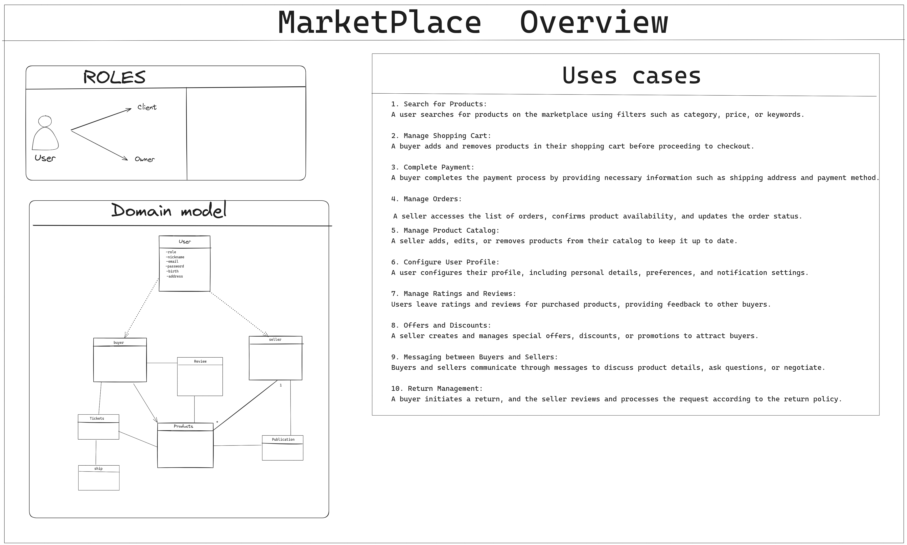

# Fullstack Marketplace

## Description

## Design and Analysis

### Domain Model

## Technology Stack

### Backend (Nest.js)

- **Description**: The backend of the application is built with Nest.js, a Node.js framework utilizing TypeScript.
- **Key Features**:
  - Modular and scalable architecture.
  - Use of decorators and metadata for streamlined development.
  - Dependency injection system for efficient component management.
  - Utilizes TypeORM for seamless database integration

### Frontend (Vue.js)

- **Description**: The user interface is constructed with Vue.js, a JavaScript framework for building interactive user interfaces. Vuetify, a material design component framework, is used for UI components.
- **Key Features**:
  - Reactivity for a dynamic user interface.
  - Reusable components and modular structure.
  - Seamless integration with the backend through HTTP requests using Axios.
  - Vuetify components for a consistent and aesthetic UI.

### Database (PostgreSQL with Docker Compose)

- **Description**: The database employs PostgreSQL, a relational database management system. Docker Compose is used to simplify the setup and management of the PostgreSQL container.
- **Key Features**:
  - Relational data model for structuring information.
  - ACID transactions to ensure data consistency.
  - Support for complex queries and relationships.

## Project Setup

## Usage
